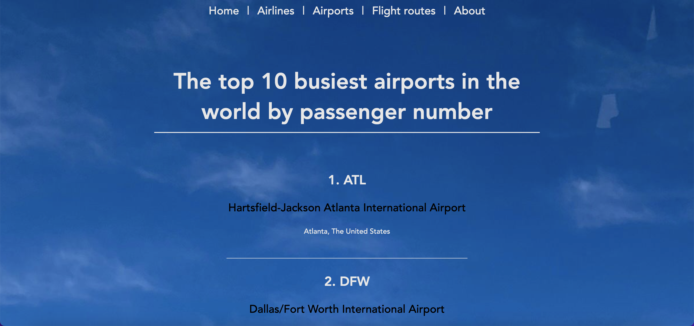

# Flight App with Vue

This app was created as a school task in my exchange studies.

- On Home page you can see general information about flying.
- On Airlines page you can find the largest airlines in the world by passengers carried
- On Airports page you can find the top 10 busiest airports in the world by passenger number
- On Flight routes page you can find the top 10 busiest international routes in the world
- On About page you can find brief information about the page




## Project setup
```
npm install
```

### Compiles and hot-reloads for development
```
npm run serve
```

### Compiles and minifies for production
```
npm run build
```

### Customize configuration
See [Configuration Reference](https://cli.vuejs.org/config/).
